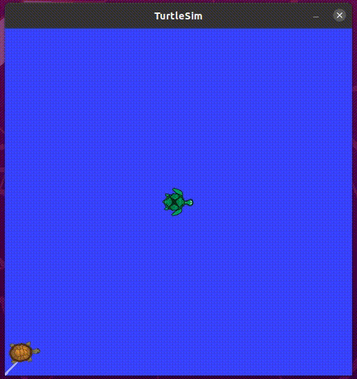

# Turtle Hunter

## Task

Write a node that gets pose of one turtle and makes another turtle moves to it.

## Usage

- Create victim turtle `rosrun turtlesim turtlesim_node`.

- Create hunter turtle `rosservice call /spawn "{x: 1.0, y: 1.0, theta: 0, name: 'hunter'}"`.

- Use `hunting.py` to make one turtle moves to another.

- To move victim turtle use `rosrun turtlesim turtle_teleop_key`.

## Example

A brown turtle is chasing a green turtle.

