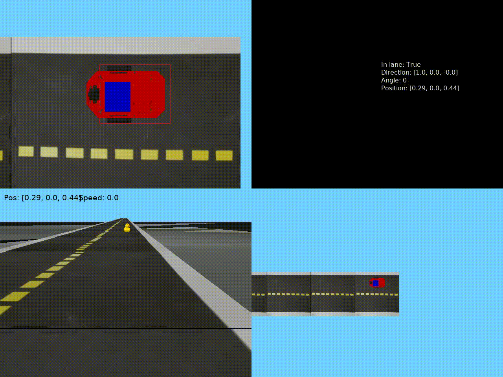

# Duckietown

### [Part 1](part_1.py)

- Остановиться перед уточкой. 

- [Ссылка](https://github.com/OSLL/aido-auto-feedback/tree/b6af6c092d4c366e7836248a3e8f47d3439533bf8ed188f27fbdc9d7) на лог решения.

#### Result

### [Part 2](part_2.py)

- Объехать уточку и остановиться.

- [Ссылка](https://github.com/OSLL/aido-auto-feedback/tree/61ccf92750f66af10dd5c2369c273ce711a3a756b2a96bc9f809b771) на лог решения.

#### Result

